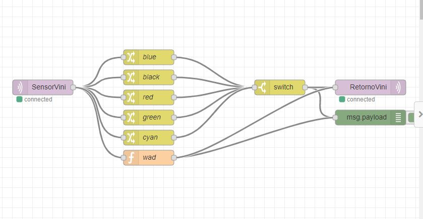

# Projeto 6

## Node Red com comunicação mqtt

https://nodevinicius.mybluemix.net/red/#flow/62ccf842.2499e8

https://youtu.be/yw21wx0tTnM

O Node Red esta recebendo os dados do broker( esta sendo enviada a tecla pressionada do teclado)
e com esse dado ele faz um tratamento para que com algumas teclas seja retornado o nome de uma cor.
Ex.: a retorna blue, b retorna black.
Esses dados são recebidos no [codigo do projeto 5](../../projeto5/vinicius/vinicius.html) e a cor do h1 do html é alterada.
